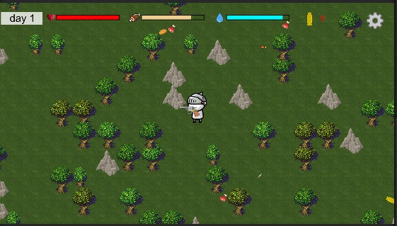

# Zombie Survival(좀비 서바이벌)

## Game Introduction(게임 소개)

인게임 화면

> 10일간 좀비마법사에게서 살아남는 2D 서바이벌 슈팅 게임
> 
> 
> 낮에는 음식과 물, 회복주사기를 얻어 밤에는 몰려오는 좀비마법사에게서 살아남자!
> 
> 날이 지날수록 좀비마법사는 몰려오고! 총은 노후화되어 점점 약해진다…
> 
> 구조가 될때까지 남은 기간 10일 과연 기사덕후인 우리 주인공은 살아남을 수 있을까?
> 

---

## Software Introduction(소프트웨어 소개)

> **World(Level Design)**
> 
- 월드는 소스코드를 활용하여 사용
    - [https://github.com/mapisarek/Survival_Zombie_2D](https://github.com/mapisarek/Survival_Zombie_2D)
- 시드넘버에 따라 랜덤으로 맵과 장애물이 생성

    

    

- 사용 스크립트

    | Script | 설명 |
    | --- | --- |
    | Boundary.cs | 맵 경계 설정 |
    | CSVReader.cs | 오픈소스코드 |
    | MeshData.cs | 오픈소스코드 |
    | Noise.cs | 오픈소스코드 |
    | SpriteLoader.cs | 오픈소스코드 |
    | Tile.cs | 오픈소스코드 |
    | World.cs | 오픈소스코드 |

> **UI**
> 
- **UI**
    | Scene | 설명 | 기능 |
    | --- | --- | --- |
    | StartScene | 게임 시작 화면 | Game Start Button(누르면 Game Scene으로 넘어감), Quit Button(누르면 게임이 종료됨) |
    | GameScene | 게임 플레이 화면 | Health bar(체력 바), Hungry bar(배고픔 바), Thirsty bar(목마름 바), Remain bullet(남은 총알 개수), Option button(옵션 버튼) |
    | OptionPanel | 옵션 화면 | BGM Volume Slider(배경 음악 조절), Master Volume Slider(전체 볼륨 조절) |
    | ClearScene | 게임 클리어 화면 | BackToMain Button(누르면 Start Scene으로 돌아감) |
    | GameOverScene | 게임 오버 화면 | BackToMain Button(누르면 Start Scene으로 돌아감) |
- **UI** **Images**
    - **StartScene**
        
        
        
    - **GameScene - Basic Game Panel**
        
        
        
    - **OptionPanel**
        
        
        
    - **ClearScene**
        
        
        
    - **GameOverScene**
        
        
        
- **Scripts**
    - **Startcene**

        | Script | 설명 |
        | --- | --- |
        | SC_BGS.cs | GameStartButton 클릭시 GameScene으로 Scene을 바꿔줌 |
        | Quit.cs | QuitButton 클릭시 프로그램을 종료 구현 |
    - **GameScene**
        
        | Script | 설명 |        
        | --- | --- |
        | Healthbar.cs | 체력 바 구현 |
        | Hungrybar.cs | 배고픔 바 구현 |
        | Thirsty.cs | 목마름 바 구현 |
        | PlayerShooting.cs | 총알 개수를 텍스트로 출력하도록 구현 |
        | SC_Option.cs | Option Panel의 SetActive를 true로 바꾸어 활성화되도록 구현 |
    - **OptionPanel**

        | Script | 설명 |        
        | --- | --- |
        | SC_Option.cs | Option Panel의 SetActive를 false로 바꾸어 비활성화되도록 구현 |
    - **ClearScene**

        | Script | 설명 |        
        | --- | --- |
        | SC_Start.cs | BackToMain Button 클릭시 StartScene으로 Scene을 바꿔줌 |
    - **GameOverScene**
        
        | Script | 설명 |        
        | --- | --- |
        | SC_Start.cs | BackToMain Button 클릭시 StartScene으로 Scene을 바꿔줌 |
        

> **Inventory(인벤토리)**
> 

- **Scripts**
    
    | Script | 설명 |        
    | --- | --- |
    | slot.cs | 슬롯의 상호작용(슬롯 클릭 확인)  |
    | Inventory.cs | 인벤토리 상호작용(인벤토리 열기/닫기, 아이템 사용,사용 아이템 삭제) ,필드에 떨어져 있는 아이템 획득 |
    | InventortUI.cs | 인벤토리 UI 조절, 인벤토리 내 아이템 정렬,  슬롯의 위치 관리 |
- **참고 오픈소스 및 영상**
    
    [https://github.com/mapisarek/Survival_Zombie_2D](https://github.com/mapisarek/Survival_Zombie_2D)
    
    [https://www.youtube.com/@DevGomDal](https://www.youtube.com/@DevGomDal)
    

> **Item(아이템)**
> 
- **사용법**
    
    
    
    - 필드에 떨어져 있는 아이템에 닿으면 해당 아이템 획득
    
    
    
    - 획득 한 아이템은 인벤토리로 이동.
    - 사용하고자 하는 아이템 좌클릭시 아이템 사용

- **종류**
    - 체력 회복: 체력 회복 아이템. hp 30 증가
        
        
        
        Injector
        
    - 목마름 회복: 목마름 회복 아이템. 목마름 20 증가
        
        
        
        waterbottle
        

- 배고픔 회복: 배고픔 회복 아이템, 배고픔 20 증가
    
    
    
    meat
    
    
    
    Ham
    
    
    
    bmeat
    
    
    
    bread
    
- **Scripts**

    | Script | 설명 |            
    | --- | --- |
    | Fielditems.cs | 필드에 떨어져 있는 아이템을 표현하기 위한 객체 |
    | Item.cs | 아이템의 정보를 담는 객체 |
    | ItemDatabase.cs | 아이템 데이터베이스. 생성된 Item 목록에 아이템 정보 입력. |
    | ItemEffect.cs | 사용 가능 아이템이 가지는 인터페이스. ExecuteRole()를 재정의 하여 사용 |
    | Item(Hp/ST/TH)UpEffect.cs | 아이템 사용 시 hp/배고픔/목마름을 회복 시키는 메서드를 실행시키기 위한 코드 |
    | ItemSpawner | 아이템 스포너, 플레이어 주변에 특정 시간마다 아이템 생성 |
- **참고 오픈소스 및 영상**
    
    [https://github.com/mapisarek/Survival_Zombie_2D](https://github.com/mapisarek/Survival_Zombie_2D)
    
    [https://www.youtube.com/@DevGomDal](https://www.youtube.com/@DevGomDal)
    

> **Character(캐릭터)**
> 
- **Character List**

    | Script | 설명 |            
    | --- | --- |
    | Player | 체력, 배고픔, 목마름, Enemy공격
    체력이 0이면 죽음 , 배고픔이나 목마름 수치가 0이면 체력이 감소 |
    | Enemy | 체력, Player공격 |
- **Scripts**
    
    | Script | 설명 |            
    | --- | --- |
    | UnitMgr.cs | 전체적인 Character control(몬스터 체력감소, 코루틴을 통한 Character의 죽음 시 행동 구현 등) |
    | UnitCode.cs | UnitMgr가 Control 할 대상(Player, Enemy) 설정 |
    | Status.cs | Player, Enemy의 스테이터스 설정(attack damage, HP, Hunger 등) |
    | Move.cs | Player의 움직임 구현 |
    | EnemyAI.cs | Enemy의 움직임, Player에 대한 공격 구현과 Player체력감소 |
    | MonsterSpawner.cs | 몬스터 스폰구현 |
- **Asset**
    - Player: [https://assetstore.unity.com/packages/2d/characters/2d-simple-character-swordman-133259](https://assetstore.unity.com/packages/2d/characters/2d-simple-character-swordman-133259)
    - Enemy: [https://craftpix.net/freebies/free-2d-monster-sprites/](https://craftpix.net/freebies/free-2d-monster-sprites/)

> **Sound(배경 음악, 효과음)**
> 
- **배경 음악**
    - John Murphy - In the House, In a Heartbeat
    - 아티스트명 표기 시 해당 프로젝트에서 음원 사용 가능함을 확인함
    - 게임 진행 중에는 무한 반복
- **효과음**
    - 옵션 버튼 클릭, 아이템 획득, 적 공격, 플레이어 사망, 무기 장전 및 발사 시 효과음 출력
    - 하단 링크에 표기된 사이트에서 무료 사운드 사용
- **Slider(슬라이더)**
    - 옵션 화면에 BGM Slider, Master Slider 존재
    - BGM Slider: 배경 음악 볼륨 조절
    - Master Slider: 게임 전체 볼륨 조절
- **Scripts**

    | Script | 설명 |            
    | --- | --- |
    | SetVolume.cs | BGM Slider 설정 |
    | SetGlobalVolume.cs | Master Slider 설정 |
    | PlayerShooting.cs | 무기 관련 효과음 출력 |
    | Inventory.cs | 아이템 획득 시 효과음 출력 |
    | UnitMgr.cs | 플레이어 사망 시 효과음 출력 |
    | EnemyAI.cs | 적 공격 시 효과음 출력 |
- **사운드 출처**
    - 버튼 클릭, 아이템 획득, 무기 효과음: [https://pixabay.com/sound-effects/](https://pixabay.com/sound-effects/)
    - 공격 및 사망: [https://www.videvo.net/royalty-free-sound-effects/](https://www.videvo.net/royalty-free-sound-effects/)
- **참고 오픈소스 및 영상**
    
    [https://www.youtube.com/watch?v=xNHSGMKtlv4](https://www.youtube.com/watch?v=xNHSGMKtlv4)
    

> **Weapon(무기)**
> 
- **무기**
    - 플레이어는 기본적으로 총을 무기로 사용함
    - 플레이어가 가질 수 있는 최대 총알 개수는 6발
    - 남아 있는 총알 개수는 목마름 바 옆에 표기됨
- **슈팅**
    - 마우스 우클릭 시 총알을 하나 소비하여 마우스가 바라보는 방향으로 총알을 하나 발사함
    - 총알은 발사 후 1초가 지나거나, 적에게 맞으면 사라짐
    - 총알 발사 후 다음 총알 발사까지 0.4초의 딜레이가 존재함
    - 총알을 모두 사용하면 기존 발사 효과음 대신 다른 효과음을 출력함
- **재장전**
    - 재장전 시 플레이어의 총알이 6발 채워짐
    - 남아 있는 총알 개수에 상관 없이 언제나 재장전이 가능하며, 재장전 횟수 제한은 없음
    - 단, 재장전 후 0.9초가 지나기 전에는 재장전이 불가능함
- **Scripts**
    
    | Script | 설명 |            
    | --- | --- |
    | PlayerShooting.cs | 마우스 방향으로 총알을 발사하고, 총을 재장전함 |
    | Bullet.cs | 총알 생성 후 1초가 지나거나, 총알이 적에게 맞으면 총알을 없앰 |
- **Asset**
    - Bullet: [http://pixelartmaker.com/art/e05a8201e209023](http://pixelartmaker.com/art/e05a8201e209023)
    - Gun: [http://clipart-library.com/clipart/gie5B4z7T.htm](http://clipart-library.com/clipart/gie5B4z7T.htm)
- **참고 오픈소스 및 영상**
    
    [https://www.youtube.com/watch?v=-bkmPm_Besk](https://www.youtube.com/watch?v=-bkmPm_Besk)
    

> **Time(시간)**
> 
- **설명**
    
    
    
    게임의 하루는 120초, 총 10일 생존이 목표
    
    
    
    낮
    
    
    
    밤
    
    하루동안 낮과 밤이 존재하며, 낮에는 아이템이 스폰되며 화면이 밝아지고, 밤에는 몬스터가 스폰되며 화면이 어두워진다.
    
- **Scripts**
    
    | Script | 설명 |            
    | --- | --- |
    | DayTime.cs | 날짜와 시간, 낮과 밤, 몬스터와 아이템 스폰기간 구현 |

---

## How To Install(설치 방법)

> You can download it by `git clone` to the folder you want to download. 
다운받고자 하는 폴더에 `git clone`을 해서 다운받을 수 있습니다.
> 

> Alternatively, you can use **Download ZIP** to download a ZIP file.
> 
> 
> 또는 Download ZIP을 사용해서 압축 파일로 다운받을 수 있습니다.
> 

> You can install it in other ways.
> 
> 
> 이외에도 다른 방법으로 설치가 가능합니다.
> 

---

## How To Use(사용 방법)

- You can play the game by running **좀비 서바이벌.exe**.
- **좀비 서바이벌.exe**를 실행시켜서 게임을 플레이할 수 있습니다.

---

## How To Play(플레이 방법)

| key | 기능 |
| --- | --- |
| 방향키 | Player이동 |
| I | 인벤토리 열기 |
| R | 총알 장전 |
| 마우스 좌클릭 | 인벤토리 아이템 사용, 버튼 클릭 |
| 마우스 우클릭 | shooting |

낮에 아이템을 수집하여 밤에 출현하는 몬스터들에게 죽지 않고 30일 생존 시 게임 클리어

배고픔과 목마름이 0이면 체력 감소, 체력이 0이면 게임 오버

---

## License(라이선스)

- MIT license 사용